#  SchoolHub - Android School Management App📚

## Overview
**SchoolHub** is a complete Android-based school management system supporting three roles: *students, **teachers, and **registrars*. It provides robust features such as marks entry, attendance tracking, schedule management, assignment submission, and notifications — all through an intuitive role-based UI.

> 🎨 The app interface was *initially designed in Figma, then developed in **Android Studio (Java)* with a *PHP-MySQL backend* hosted on a *global hosting server*, allowing remote access and real-time data syncing.

---

## 🚀 Features Overview

### 👨‍🎓 Student Features
- 📊 View marks (Quiz, Assignment, Mid, Final) by subject
- 📆 View today's schedule and upcoming events
- 📁 Submit and download assignments
- ✅ Track attendance history
- 🔔 Receive and manage notifications
- 🏆 View class leaderboard
- 📅 Add school events to calendar

### 👩‍🏫 Teacher Features
- 📝 Publish marks for any student/class/subject
- 📋 View grade summary and top students
- 📷 QR code-based student attendance
- 📅 Schedule exams with time conflict detection
- 🔔 Push notifications for reminders and updates
- 🏆 Class leaderboard with medals
- 📥 View student submissions

### 🧑‍💼 Registrar Features
- 🏫 Manage class schedules (class, teacher, subject, time)
- ⏱ Conflict detection to avoid overlapping schedules
- 📚 Assign teachers to subjects and classes
- 📅 Create and update the full timetable

### 🔔 Notifications
- System-wide and role-based notifications
- Push notification support
- Mark as read/unread with visual status (green/red dot)
- Expandable cards on tap

---

## 🖼 Screenshots

> 💡 All screenshots are from the actual running app. Images are resized for readability.

### 🔐 Login Interface
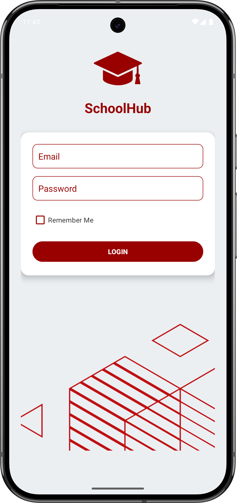

---

### 👨‍🎓 Student Interfaces

#### Student Dashboard
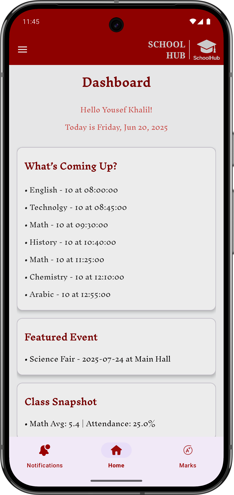

#### Student Marks
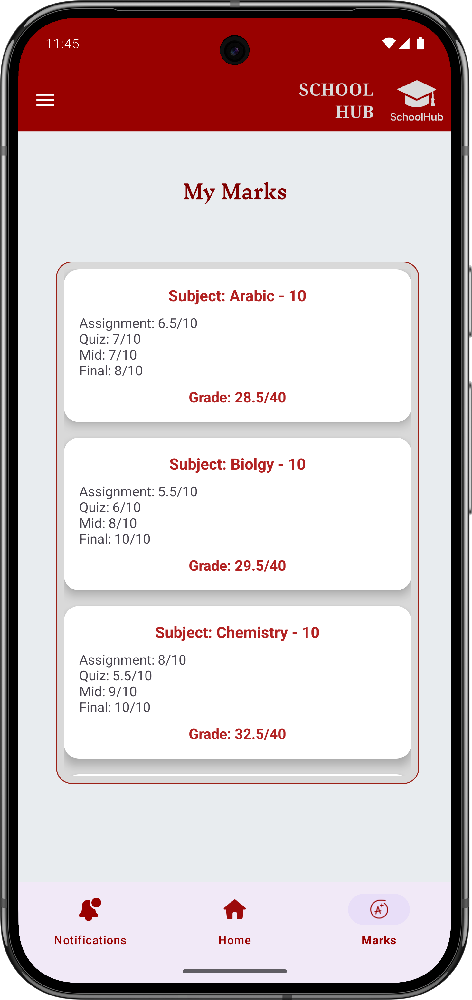

#### Attendance Page
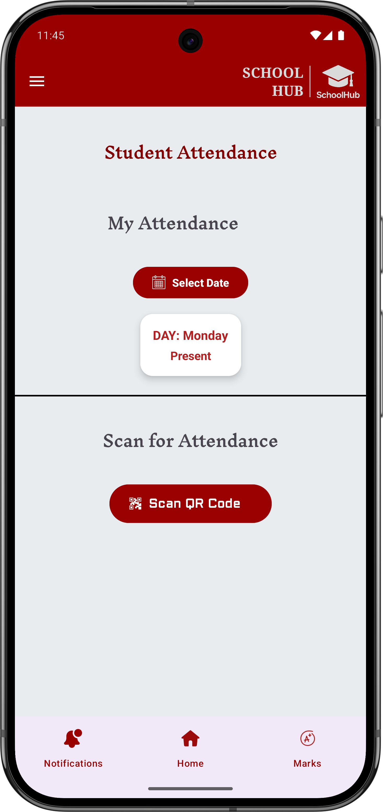

#### Assignments Page
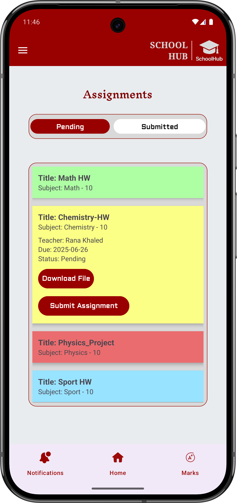

#### Event Calendar
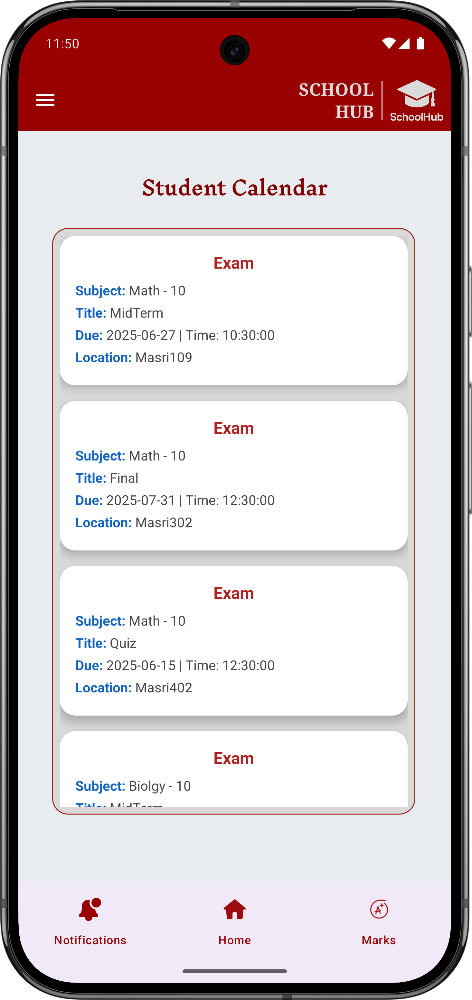

#### Event Board (Details Page)
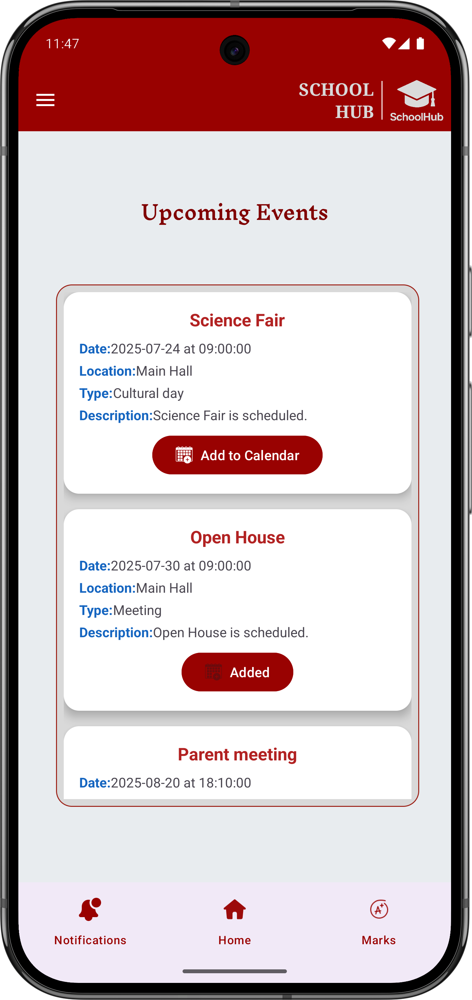

#### Student Leaderboard
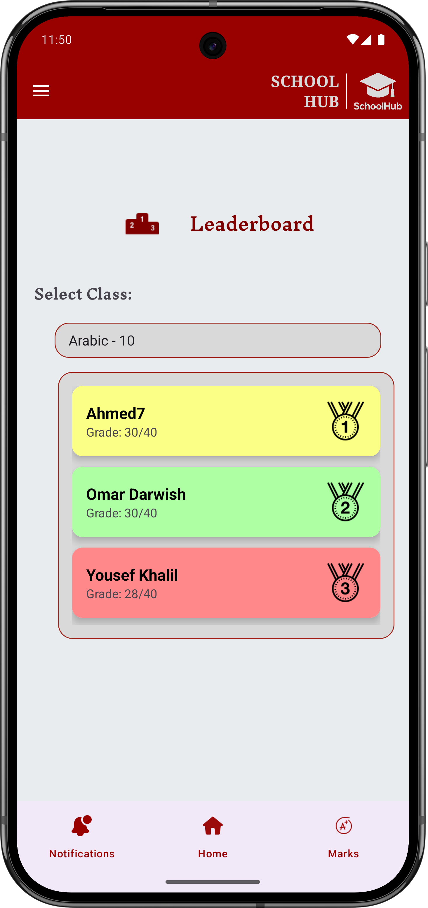

---

### 👩‍🏫 Teacher Interfaces

#### Teacher Dashboard
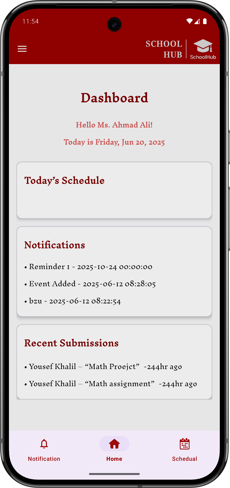

#### Publish Marks Page
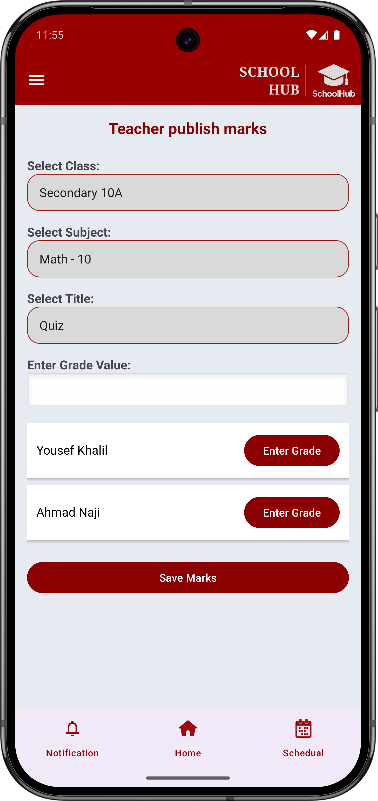

#### View Grade Summary
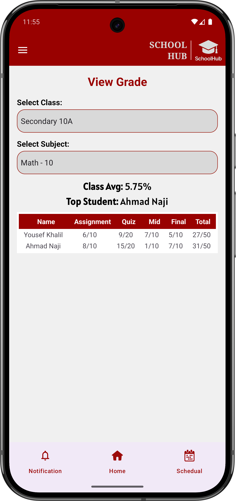

#### Take Attendance
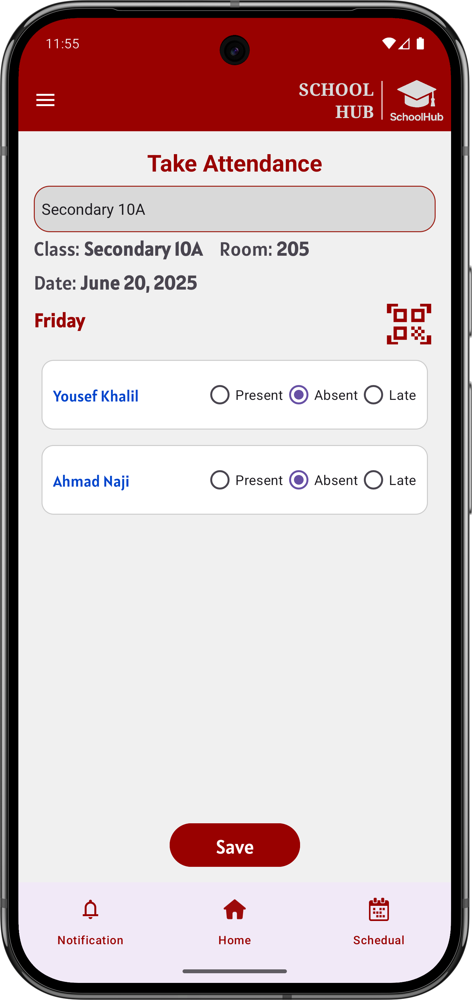

#### Take Attendance Using QR Scanner
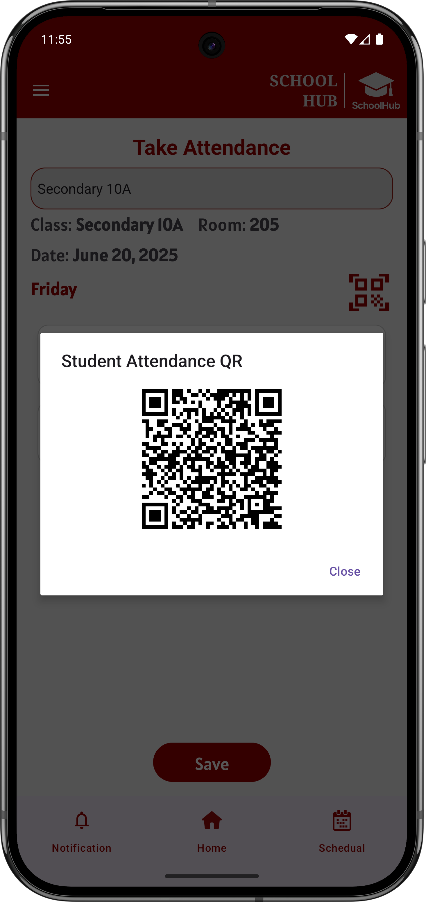

#### Schedule Exam Page
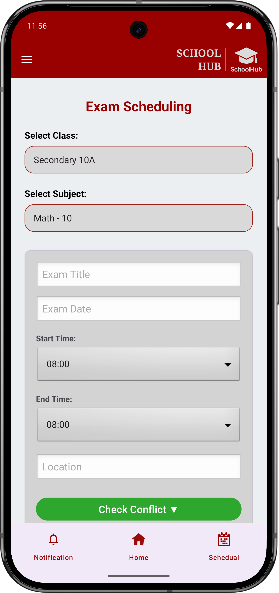

#### Leaderboard with Medals
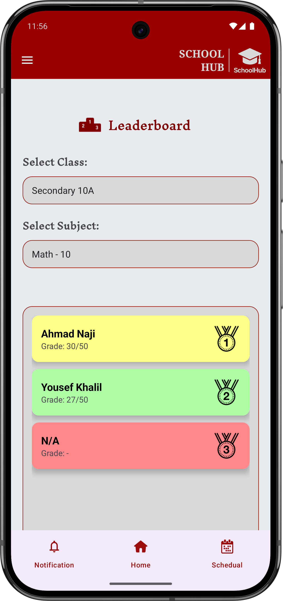

---

### 🧑‍💼 Registrar Interfaces

#### Registrar Dashboard
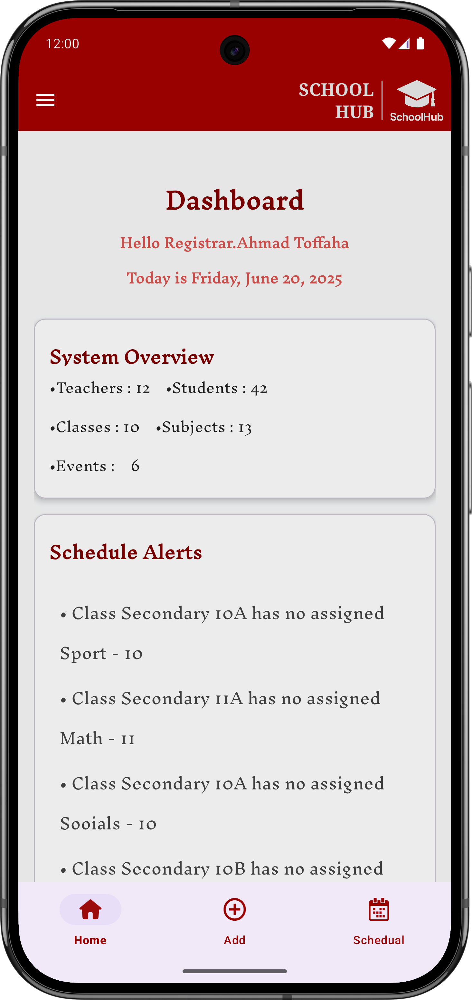

#### Schedule Builder
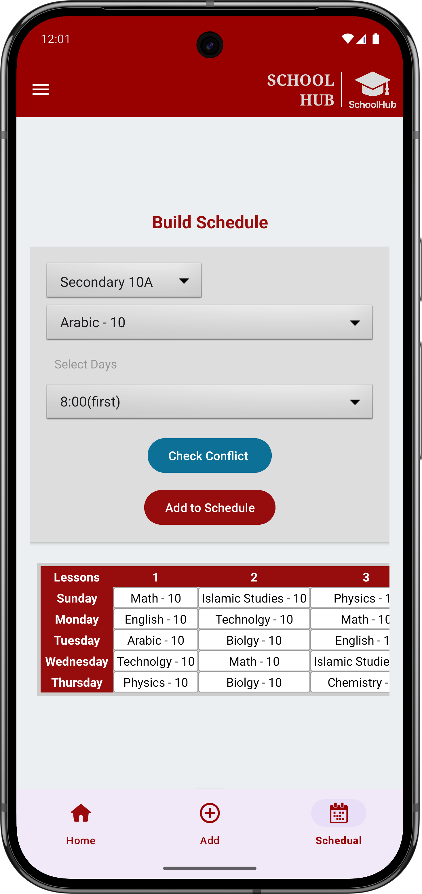

#### Add Class
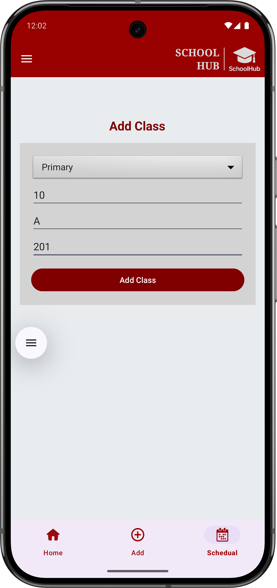

#### Add Student
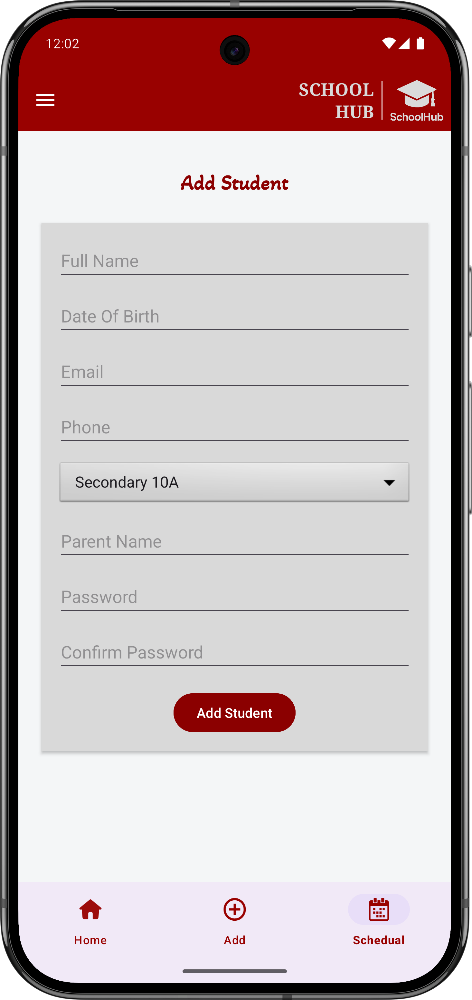

#### Add Teacher
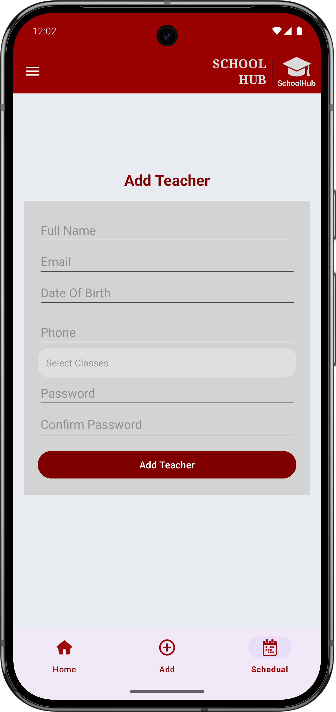

---

### 🔔 Notifications Page

#### Notification List with Status Dots
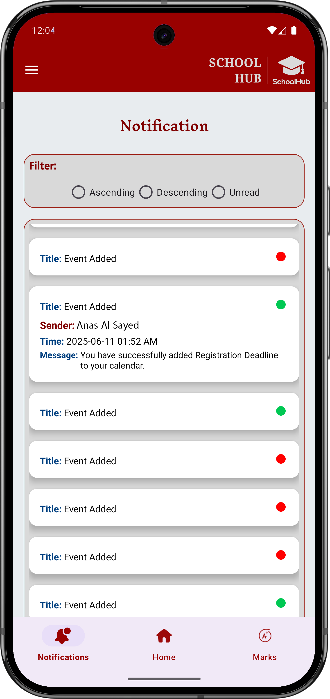

---

## 🎬 Demo Video

Watch a full walkthrough of the app showcasing all user roles and features:

---

## 🛠 Technologies Used

- *Android Studio (Java)*
- *PHP (backend APIs)* hosted on a *remote server*
- *MySQL* database (global access via hosting)
- *Volley* for API communication
- *Zxing* for QR scanner functionality
- *Figma* for UI/UX design prototypes
- *Custom layouts* with RecyclerView, CardView, and Fragments
